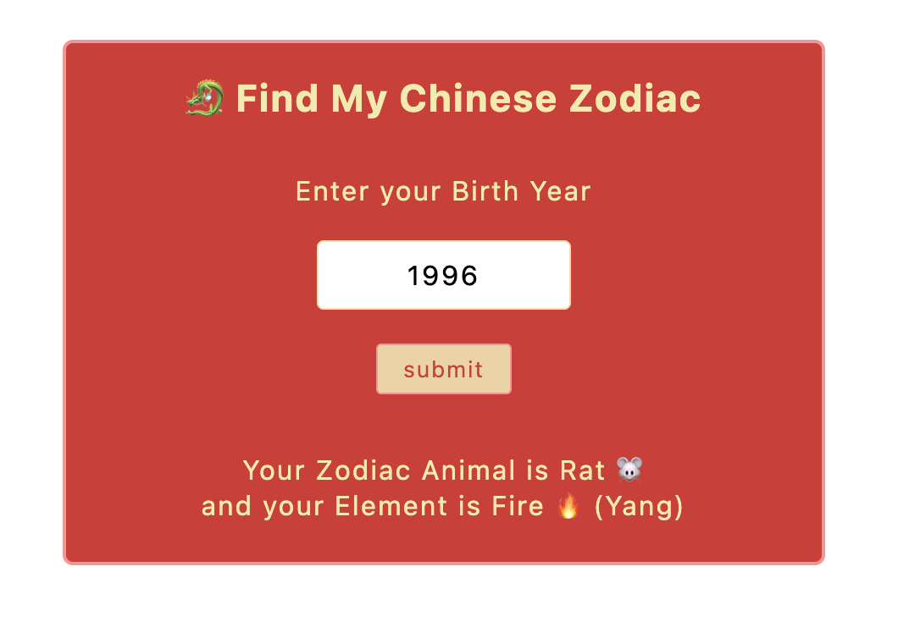
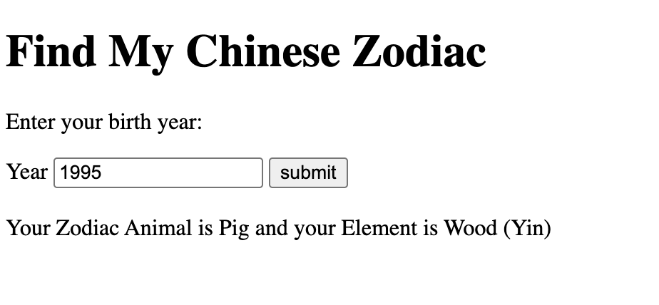

# Description
This simple Zodiac calulcator takes a birth year and returns back the user's Zodiac Animal, Element and Taijitu (Yin or Yang).

### Deployment Link: https://shaepy.github.io/find-your-zodiac/

## 📌  Tech Stack
- HTML5: structure
- CSS3: styling and responsive layout
- JavaScript (Vanilla): logic and interactivity

## Process
1. Started with HTML scaffolding to create the year input field, a button to submit that year, and some text with placeholder `div` for the results to display.

2. Created an array of `animals` and an object `elementsObj` that holds elements with their taijitu.

3. Cached element references as constant variables for HTML elements: `submit`, `form`, `display`, and `yearInputField`
5. Created a `findZodiac(year)` function that takes in a `year` and calculates what `animal`, `elements` (that holds `element`, and `taijitu`), then assign that to the `zodiac` object.

6. Added an event listener to the `form` element that takes the submitted value in the input field.
    * Using `e.preventDefault()` to prevent the default refresh after clicking a button

7. Set up a validation check for the form to make sure the year input is a valid 4-digit year. I used `if (year && yearInput.length === 4)`. Since `.length` cannot be used on a number, we kept `yearInput` as the string returned from `formdata` to validate whether the value is 4 digits. We also want `if (year)` to validate that `Number()` returns a true number, rather than `NaN`, which means the value was not a string of numbers.
    * If failing the validation (`else`), `form.reset()` will reset the input field after to give it more responsiveness.
    * It is intended to allow years 1000-9999 in fun situations of trying to guess the zodiac of a historical figure or future child.
8.  Display using `display.innerHTML` the returned `animal`, `element`, and `taijitu` from the `zodiac` object after the `findZodiac` function is called (passing validation).

9. Added event listener for `yearInputField` so when users interact with the field after a result, it'll refresh the display.

#### Early Concept

#### Added CSS styling

## Project Brief (MVP)
### Goal  
Build a simple, responsive web app that takes a user’s birth year as input and returns their corresponding Chinese zodiac animal.
#### Objectives
- Let users discover their Chinese zodiac sign based on their birth year.
- Clean, beginner-friendly codebase for practice with HTML/CSS/JavaScript.
- Support for desktop and mobile use.

### Features
#### 1. User Input
- Input field (number or dropdown) for user to enter their **birth year** (e.g., 1995).
- Submit button to calculate their Chinese zodiac sign.
#### 2. Output Display
- Display the **zodiac animal** (e.g., *“You are a Pig!”*).
- Display the **element** (e.g., *"You are Year of the Pig and element of Wood!"*)
- Optional: Show the chinese characters (e.g., *“猪 (Zhū)”*).
#### 3. Logic
- Use JavaScript to calculate the zodiac animal based on a 12-year cycle:
    - Base the logic on a known reference year, such as 2020 = Rat.
- Use JavaScript to calculate the element based on their birth year.
#### 4. UI/UX
- Clear layout with an input area, result display, and basic styling.
- Mobile-friendly and accessible design.

## Stretch Goals (Post-MVP)
- Add Chinese characters and pronunciation (e.g., “Dragon – 龙 (Lóng)”).
- Include personality traits per animal.
- Zodiac cycle visualization.
- Option to share or save your result.
- Include Month and Day to use the Lunar Calendar cutoff logic for accuracy (advanced)
