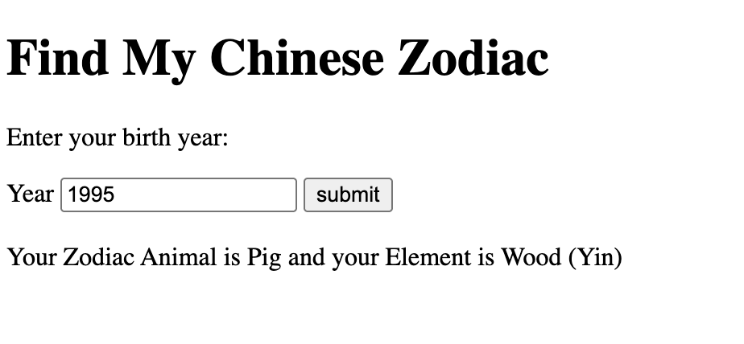

# Description
This simple Zodiac calulcator takes a birth year and returns back the user's Zodiac Animal, Element and Taijitu (Yin or Yang).

Early concept:
 

CSS applied:
 

### Deployment Link: https://shaepy.github.io/find-your-zodiac/

## 📌 Tech Stack
- HTML5: structure
- CSS3: styling and responsive layout
- JavaScript (Vanilla): logic and interactivity

## Project Brief
### 🎯 Goal  
Build a simple, responsive web app that takes a user’s birth year as input and returns their corresponding Chinese zodiac animal.

### 🎯 Objectives
- Let users discover their Chinese zodiac sign based on their birth year.
- Clean, beginner-friendly codebase for practice with HTML/CSS/JavaScript.
- Support for desktop and mobile use.

### 💡 Features (MVP Requirements)
#### 1. User Input
- Input field (number or dropdown) for user to enter their **birth year** (e.g., 1995).
- Submit button to calculate their Chinese zodiac sign.

#### 2. Output Display
- Display the **zodiac animal** (e.g., *“You are a Pig!”*).
- Display the **element** (e.g., *"You are Year of the Pig and element of Wood!"*)
- Optional: Show the chinese characters (e.g., *“猪 (Zhū)”*).

#### 3. Logic
- Use JavaScript to calculate the zodiac animal based on a 12-year cycle:
    - Base the logic on a known reference year, such as 2020 = Rat.
- Use JavaScript to calculate the element based on their birth year.
    - Metal: Years ending in 0 or 1.
    - Water: Years ending in 2 or 3.
    - Wood: Years ending in 4 or 5.
    - Fire: Years ending in 6 or 7.
    - Earth: Years ending in 8 or 9.

#### 4. UI/UX
- Clear layout with an input area, result display, and basic styling.
- Mobile-friendly and accessible design.

### 🧪 Stretch Goals (Post-MVP)
- Add Chinese characters and pronunciation (e.g., “Dragon – 龙 (Lóng)”).
- Include personality traits per animal.
- Zodiac cycle visualization.
- Add Chinese New Year cutoff logic (advanced) for accuracy based on lunar calendar.
- Option to share or save your result.